# FarmFresh Application Workflow

## 🏗️ **System Architecture Overview**

FarmFresh is a comprehensive local farmer's market platform that connects consumers with local farmers, featuring AI-powered quality assessment, dynamic pricing, and real-time inventory management.

---

## 📋 **Core User Workflows**

### **1. Customer Journey**

#### **1.1 Product Discovery & Shopping**
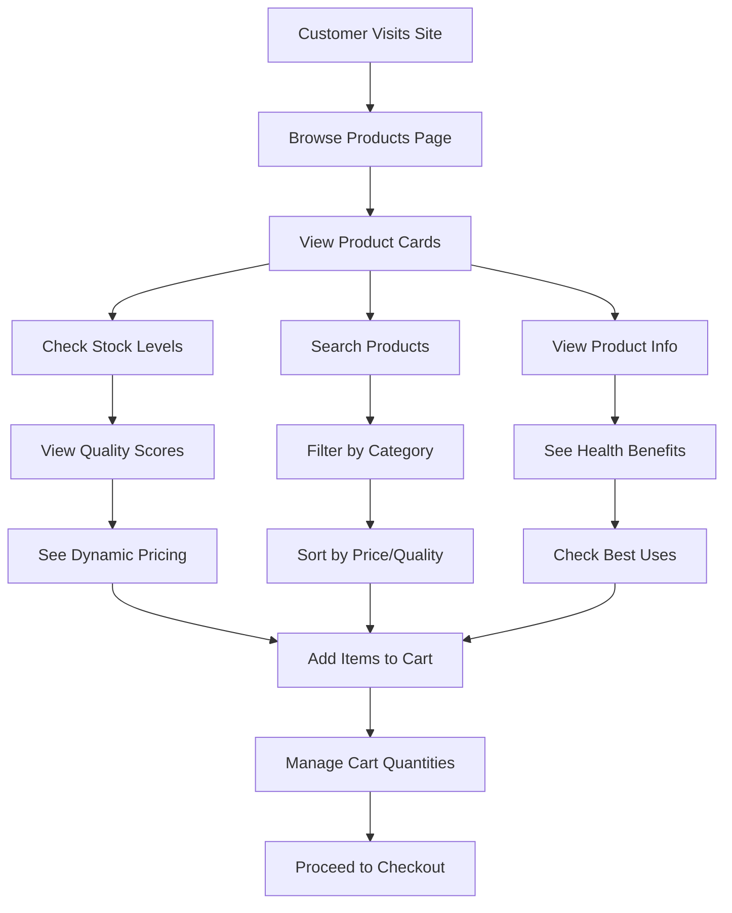

#### **1.2 Cart Management**
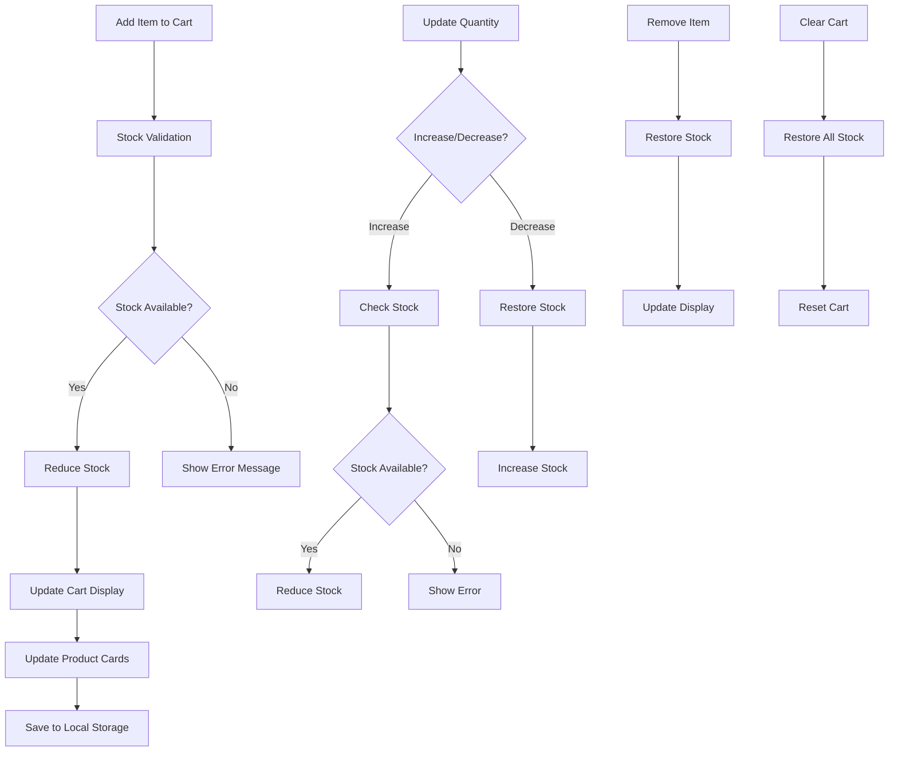

#### **1.3 Checkout Process**
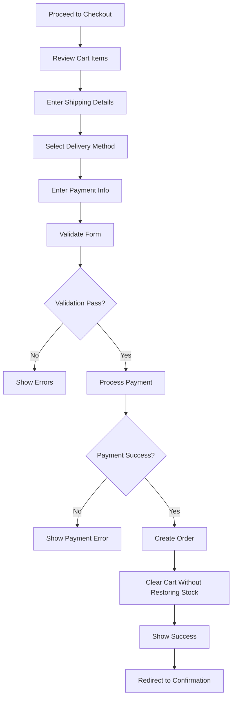

### **2. Farmer/Admin Journey**

#### **2.1 Product Management**
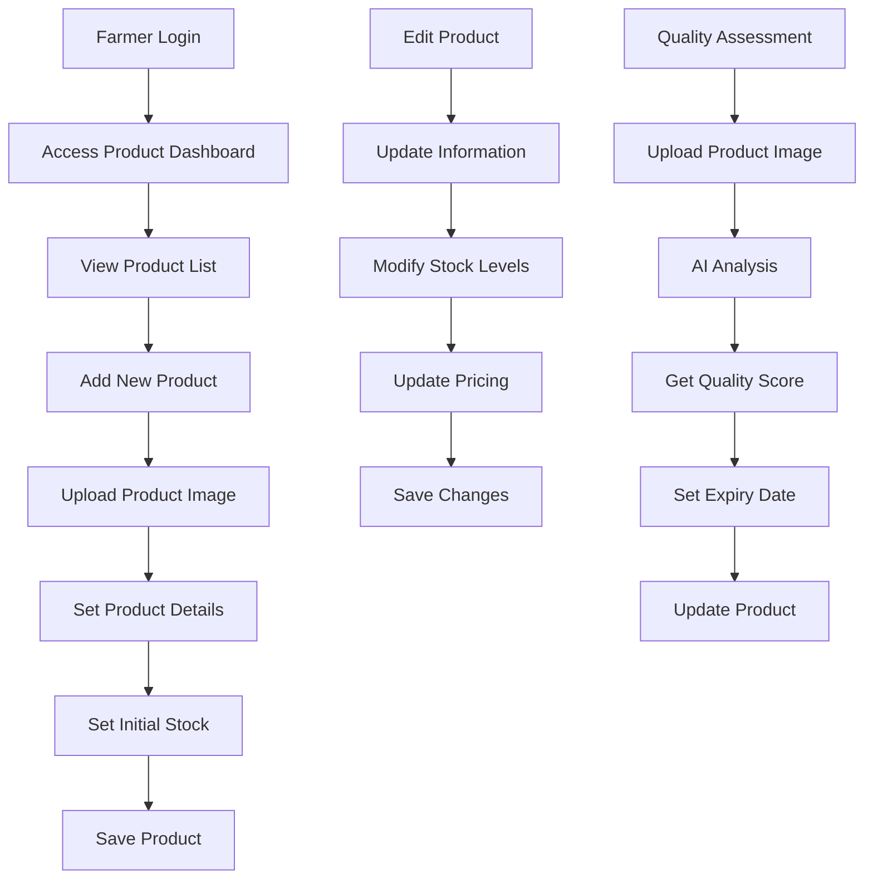

#### **2.2 AI Quality Assessment**
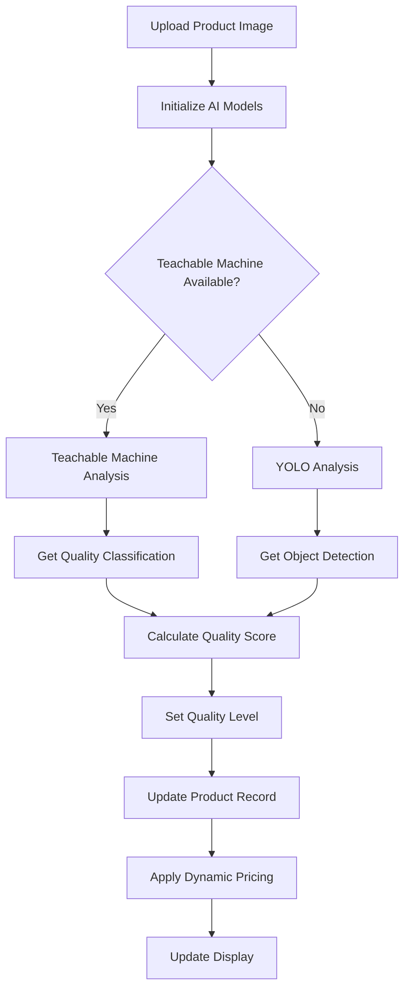

### **3. Market Discovery**

#### **3.1 Market Search & Filtering**
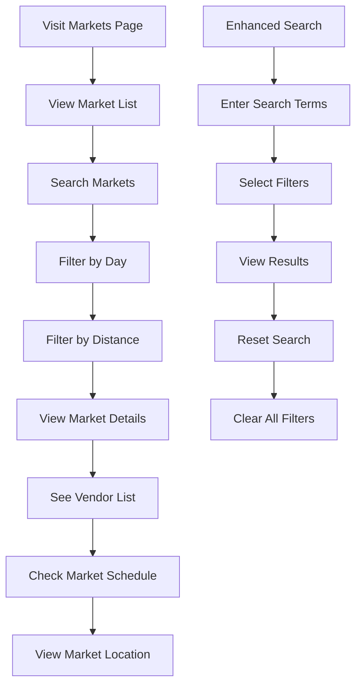

#### **3.2 Farm Tour Booking**
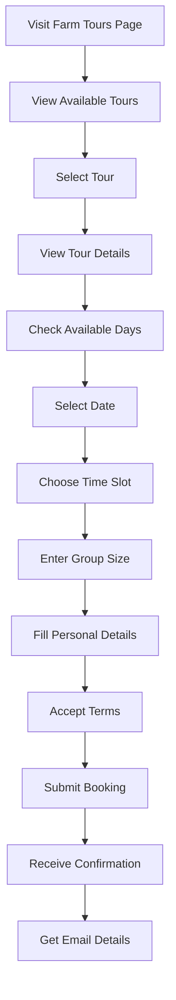

---

## 🔧 **Technical Workflows**

### **4. Stock Management System**
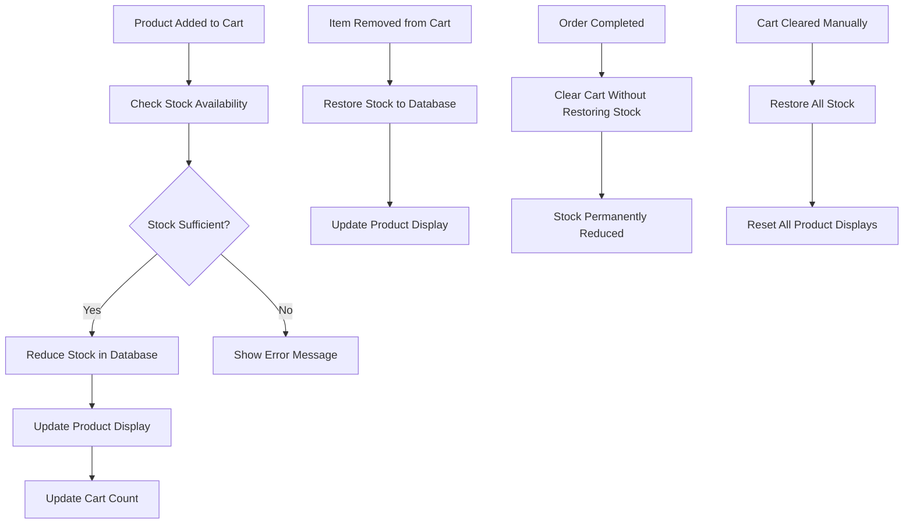

### **5. Dynamic Pricing System**
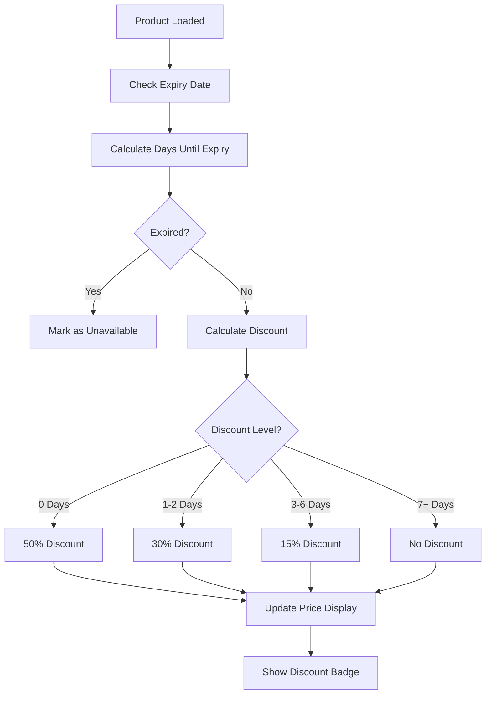

### **6. AI Integration Workflow**
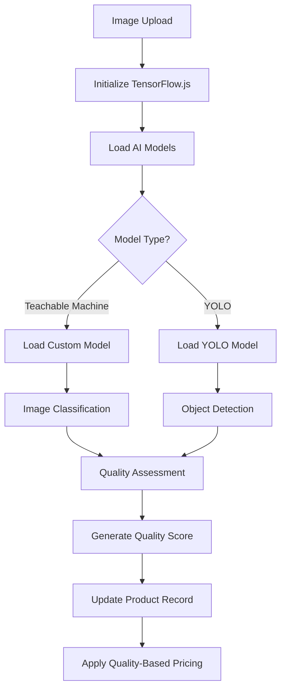

---

## 📊 **Data Flow Architecture**

### **7. API Integration**
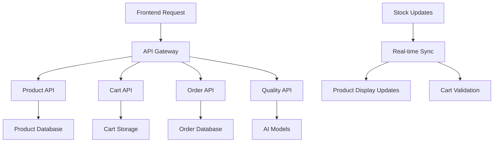

### **8. Storage Management**
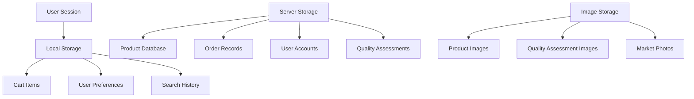

---

## 🎯 **Key Features & Capabilities**

### **Customer Features:**
- ✅ **Real-time Stock Management** - Live inventory tracking
- ✅ **Dynamic Pricing** - Automatic discounts based on expiry
- ✅ **AI Quality Assessment** - Machine learning quality detection
- ✅ **Smart Search & Filtering** - Advanced product discovery
- ✅ **Farm Tour Booking** - Interactive tour scheduling
- ✅ **Market Discovery** - Local market finder with filters

### **Farmer/Admin Features:**
- ✅ **Product Management** - Full CRUD operations
- ✅ **Quality Assessment** - AI-powered quality detection
- ✅ **Stock Management** - Real-time inventory control
- ✅ **Order Processing** - Complete order lifecycle
- ✅ **Analytics Dashboard** - Sales and quality insights

### **Technical Features:**
- ✅ **Responsive Design** - Mobile-first approach
- ✅ **Progressive Web App** - Offline capabilities
- ✅ **Real-time Updates** - Live data synchronization
- ✅ **AI Integration** - TensorFlow.js and Teachable Machine
- ✅ **API-First Architecture** - RESTful API design

---

## 🔄 **System Integration Points**

### **External Services:**
- **Google Teachable Machine** - AI quality assessment
- **TensorFlow.js** - Machine learning framework
- **Local Storage** - Client-side data persistence
- **RESTful APIs** - Backend communication
- **Image Processing** - Product image analysis

### **Data Synchronization:**
- **Real-time Stock Updates** - Live inventory management
- **Cart Persistence** - Cross-session cart maintenance
- **Quality Assessment Sync** - AI results integration
- **Order Processing** - Complete transaction flow

---

## 📈 **Performance Optimizations**

### **Frontend Optimizations:**
- **Lazy Loading** - Images and components
- **Debounced Search** - Reduced API calls
- **Cached Data** - Local storage utilization
- **Progressive Enhancement** - Graceful degradation

### **Backend Optimizations:**
- **API Caching** - Reduced database queries
- **Batch Processing** - Efficient bulk operations
- **Image Compression** - Optimized storage
- **Database Indexing** - Fast query performance

---

## 🛡️ **Security & Validation**

### **Data Validation:**
- **Input Sanitization** - XSS prevention
- **Form Validation** - Client and server-side
- **Stock Validation** - Prevent overselling
- **Payment Validation** - Secure transaction processing

### **Error Handling:**
- **Graceful Degradation** - Fallback mechanisms
- **User Feedback** - Clear error messages
- **Logging & Monitoring** - System health tracking
- **Recovery Mechanisms** - Automatic retry logic

---

This workflow documentation provides a comprehensive overview of how users interact with the FarmFresh platform, from initial product discovery through order completion, including all the technical processes that power the system.
